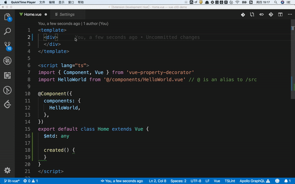
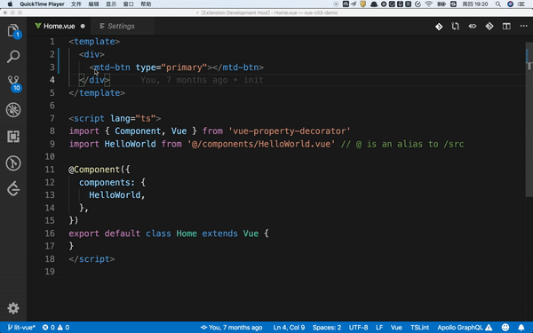

> 本仓库是mtd-vue-helper插件的说明文档仓库，实际代码暂无法开源。

# 介绍
mtd-vue支持插件  

# 使用注意  
插件会在初始化时读取node_modules中的MTD包配置，如果在插件初始化之后安装(或更新)MTD包，应该尝试重载VSCode以重新加载插件。

# 功能
### 1. 自动补全、智能提示  
+ 支持组件标签、组件prop、prop可选值、组件事件  
  

### 2. 文档快速查阅    
#### 2.1 使用   
+ 使用快捷键：Command + shirft + s
即可在VSCode编辑器内打开MTD文档地址(截止至发布时间，MTD官网还对窄屏查看支持还不够好，正在紧张排期开发中...)     
  
  
  
#### 2.2 配置  
+ 配置方式1：插件会在初始化时尝试从node_modules内安装的MTD包中读取官方文档地址配置，如果当前项目使用的是不支持插件的较旧版本MTD，可以尝试安装最新版MTD，或者在初次使用本功能时的弹窗内手动输入官方文档地址HOST进行配置。   
+ 配置方式2：在VSCode的配置页搜索doc-url进行配置   
